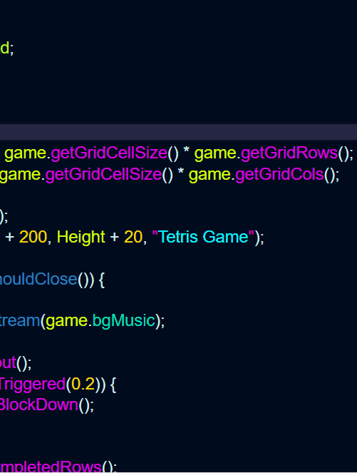
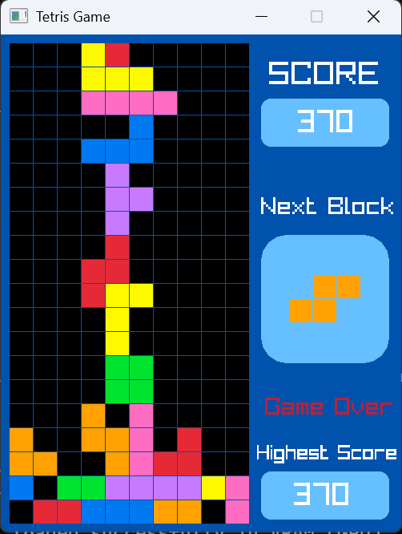

**Title & Description** -- **Tetris** -- A tetris clone built with C++ and Raylib.

**Features:**
1. All 7 Tetrominos.
2. Score System With Multiplier.
   - 1 row cleared = 100 points
   - 2 rows cleared = 400 points
   - 3 rows cleared = 600 points
   - 4 rows cleared = 1200 points
4. Persistent High Score, display player's Highest Score.
5. Background music and Sound effects.
6. Next block preview.
7. Game over and restart system.

---

**Requirements:**

1. Make sure that Raylib is properly set up in your IDE or Code editor.
2. Make sure the sounds folder is present with properly named assets.

---

**Controls:**
| Key | Action     |
|-----|------------|
|  A  | Move Left  |
|  S  | Move Down  |
|  D  | Move Right |
|  W  | Rotate     |

---

**Built With:**
 1. C++
 2. [Raylib](https://www.raylib.com/)

---

**Credits:**
- Music and Sounds: Pixabay (pixabay.com)

---

**Screenshots**

